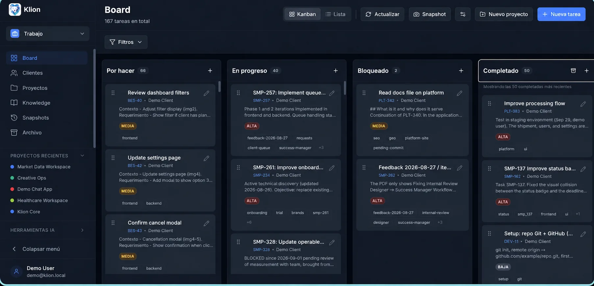
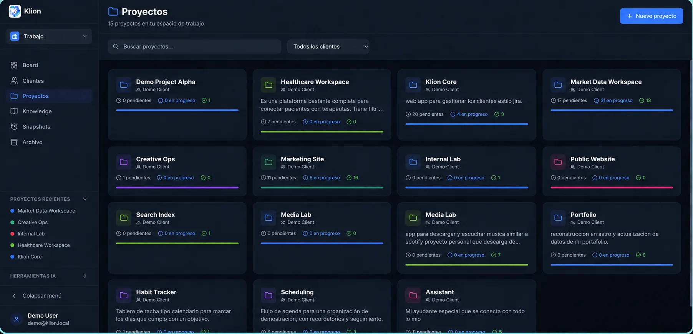
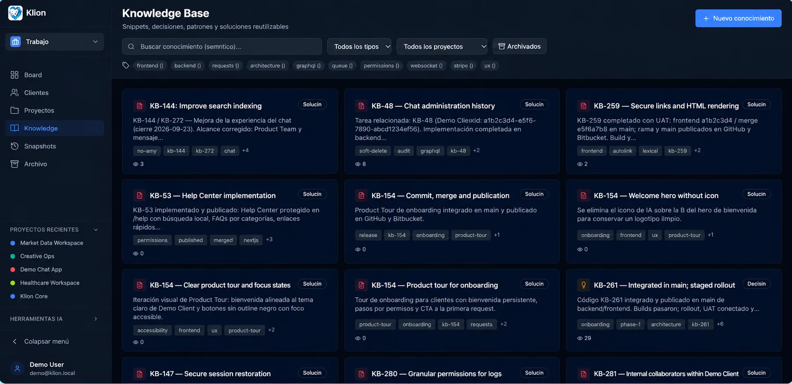
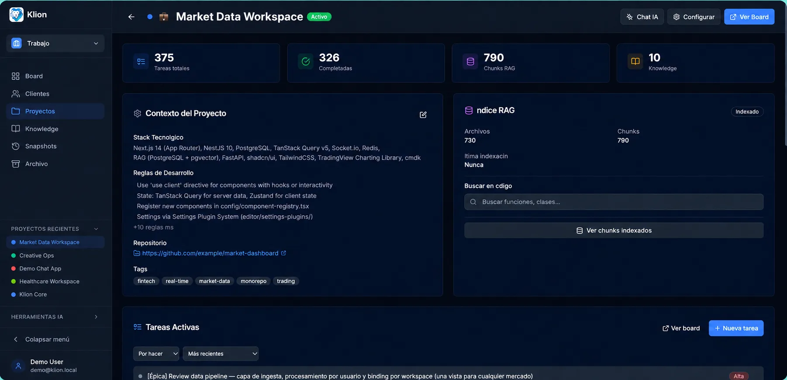
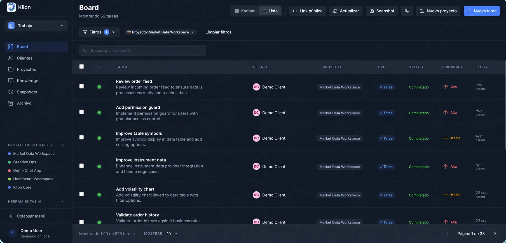

# Klion

AI-native work management for freelancers and small agencies.

Klion combines a focused Kanban board with client and project context, semantic
knowledge, codebase search, Git workflows, and an MCP server that lets AI agents
operate on real work instead of guessing from chat history.

The project is designed for a single-user or small-team deployment and is still
evolving. Review the authentication and deployment notes before using it with
production data.

## Live deployment

Klion is actively used in production at [klion.hectoracosta.dev](https://klion.hectoracosta.dev/).
The dashboard requires authentication; no demo credentials or production data are
published in this repository.

## Product screenshots

These screenshots show the main product surfaces using sanitized demonstration data.

<table>
  <tr>
    <td></td>
    <td></td>
  </tr>
  <tr>
    <td></td>
    <td></td>
  </tr>
  <tr>
    <td></td>
    <td></td>
  </tr>
</table>

## What it demonstrates

- Product ownership across a NestJS API, Next.js dashboard, PostgreSQL and Docker.
- AI features grounded in project data: summaries, daily planning, drafting,
  embeddings and natural-language code search.
- A semantic knowledge base backed by PostgreSQL and `pgvector`.
- Git integration and an MCP server/CLI for structured automation.
- Read-only public project sharing through scoped share tokens.

## Stack

| Area | Technologies |
| --- | --- |
| Backend | NestJS 10, TypeScript, TypeORM, PostgreSQL 15, `pgvector` |
| Frontend | Next.js 14 App Router, React, TanStack Query, Tailwind CSS, dnd-kit |
| AI | Google Gemini (configurable), OpenAI, embeddings and RAG |
| Operations | Docker Compose, WebSockets, Swagger, MCP and CLI tooling |

## Repository layout

```text
klion/
├── backend/             # NestJS API and domain modules
├── frontend/            # Next.js dashboard
├── mcp/                 # MCP server and CLI
└── docs/                # Setup, architecture and API notes
```

## Getting started

Requirements: Node.js 18+, Docker, and PostgreSQL 15 with `pgvector`.

```bash
git clone https://github.com/hector53/klion.git
cd klion
cp env-template .env
# Set MASTER_USER_EMAIL and MASTER_USER_PASSWORD in .env.
./setup-local.sh
```

For a manual setup, install dependencies in `backend/`, `frontend/` and
`mcp/klion-server/`, then start PostgreSQL, the API on port `3001`, and the
dashboard on port `3500`.

More detailed instructions are available in:

- [Quick start](docs/setup/QUICKSTART.md)
- [Environment setup](docs/setup/ENV_SETUP.md)
- [Architecture](docs/ARCHITECTURE.md)
- [MCP server and CLI](mcp/klion-server/README.md)

## MCP and CLI

The MCP server exposes project-aware operations such as searching knowledge,
creating tasks, reading board state and generating commit messages. Configure
the local server with the CLI after the dashboard is running:

```bash
cd mcp/klion-server
npm install
npm run build
```

## Security notes

- Secrets and environment files are intentionally excluded from Git.
- Use unique `JWT_SECRET`, `NEXTAUTH_SECRET`, database credentials and AI keys
  in every environment.
- The public sharing controller is read-only and disabled by default.
- This repository contains no client production data or credentials.

## License

MIT. See [LICENSE](LICENSE).

[](https://m8ven.ai/mcp/hector53/klion?s=readme)
